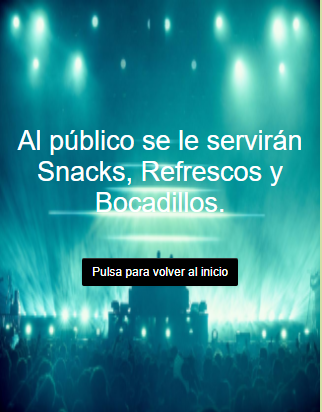
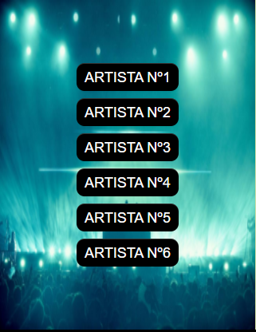
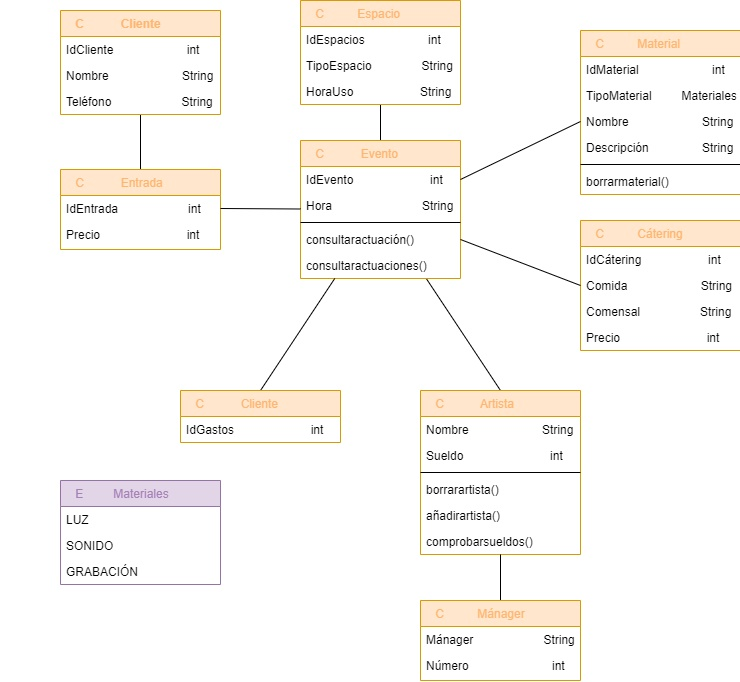

# 8. Extras
## 8.1. Prototipo de interfaz de usuario

Se ha creado una aplicación móvil orientada al usuario asistente al evento que posee
como principal función realizar consultas sobre los distintos aspectos del evento:

### Funcionamiento de la APP:

·En primer lugar, encontramos una primera pantalla de presentación, que introduce al usuario
en la aplicación. En esta pantalla encontramos además un botón que nos permitirá ir a la segunda
pantalla.

·En la segunda pantalla se sitúa el menú principal que constará de tres botones. Cada uno
de estos puede ser pulsado por el usuario y le permitirá a este realizar cada una de las
consultas que desee.

·Primer botón: muestra una pantalla con indicaciones para obtener tu IdCliente mediante tu
IdEntrada. Posee un campo de texto con su respectivo botón y según lo que se escriba mostrará
un mensaje u otro: 1º Si se escribe un IdEntrada válido, se mostrará un mensaje con el correspondiente
IdCliente. 2º Si se escribe un IdEntrada incorrecto, se mostrará un mensaje de error. Por otro
lado, esta pantalla posee un botón que nos permitirá volver al menú principal.

·Segundo botón: muestra una pantalla con un texto en el que se indica que cátering será
servido al público durante el evento. Como la anterior, también posee un botón para volver
al inicio.

·Tercer botón: muestra una pantalla con seis botones. Cada uno de estos conducirá a una nueva
pantalla con una foto del artista correspondiente, la hora de su actuación y por último un botón
que permite volver al menú principal.

[Aplicación QuevedoFest](https://github.com/miguelmartinez22/QuevedoFest/blob/master/App/QuevedoFest.aia)

 

 

 

 

 


## 8.2. Plan de pruebas

En este apartado se desarrollarán una serie de acciones sobre la base de datos con la intención de
realizar pruebas y obtener conclusiones sobre esta.

---
Solicitar un IdEvento que posea unos gastos que no existen. Se espera obtener una consulta vacía.
```sql
select IdEvento 
from Evento
where Gastos = 20;
```
Resultado:
```sql
 idevento
----------
(0 rows)
```
---
Añadir un artista nuevo a un nuevo evento. Se espera obtener un error indicando que ese artista no existe.
```sql
INSERT INTO Evento (IdEvento, Hora, Escenario, Camerino, Cátering, Backstage, Artista, Gastos) VALUES
    (7, '17:30', 'Escenario 2', 'Camerino B', 6, 'Backstage 2', 'Kiko Rivera', 2);
```
Resultado:
```sql
ERROR:  insert or update on table "evento" violates foreign key constraint "artista_fk"
DETAIL:  Key (artista)=(Kiko Rivera) is not present in table "artista".
```
---
Añadir un artista ya existente a un nuevo evento. Se espera obtener éxito.
```sql
INSERT INTO Evento (IdEvento, Hora, Escenario, Camerino, Cátering, Backstage, Artista, Gastos) VALUES
    (7, '17:30', 'Escenario 2', 'Camerino B', 6, 'Backstage 2', 'Rosalía', 2);
```
Resultado:
```sql
 idevento | hora  |  escenario  |  camerino  | cátering |  backstage  |     artista      | gastos
----------+-------+-------------+------------+----------+-------------+------------------+--------
        1 | 18:00 | Escenario 1 | Camerino A |        4 | Backstage 1 | Enrique Iglesias |      1
        2 | 20:30 | Escenario 2 | Camerino B |        6 | Backstage 2 | Rosalía          |      2
        3 | 19:00 | Escenario 3 | Camerino C |        6 | Backstage 3 | Juan Magán       |      3
        4 | 18:30 | Escenario 4 | Camerino D |       10 | Backstage 4 | Omar Montes      |      4
        5 | 19:30 | Escenario 5 | Camerino E |       11 | Backstage 5 | C Tangana        |      5
        6 | 20:00 | Escenario 6 | Camerino F |        5 | Backstage 6 | Aitana           |      6
        7 | 17:30 | Escenario 2 | Camerino B |        6 | Backstage 2 | Rosalía          |      2
(7 rows)
```
Restauración de la base de datos:
```sql
delete from evento
where IdEvento = 7;
```
---
Añadir un cliente con un IdEntrada que no existe. Se espera obtener un error indicando que primero
debemos crear la entrada correspondiente.
```sql
INSERT INTO Cliente (IdCliente, IdEntrada, Nombre, Teléfono) VALUES
    (99, 99, 'Jorge Delgado', 688455215);
```
Resultado:
```sql
ERROR:  insert or update on table "cliente" violates foreign key constraint "identrada_fk"
DETAIL:  Key (identrada)=(99) is not present in table "entrada".
```
---
Añadir un cliente con un número de teléfono que no empiece por 6 (primero debemos añadir su entrada).
Se espera obtener error.
```sql
INSERT INTO Entrada (IdEntrada, Precio) VALUES
    (17, 50);
    
INSERT INTO Cliente (IdCliente, IdEntrada, Nombre, Teléfono) VALUES
    (17, 17, 'Alberto Cuenca', 575488215);
```
Resultado:
```sql
ERROR:  new row for relation "cliente" violates check constraint "cliente_teléfono_check"
DETAIL:  Failing row contains (17, 17, Alberto Cuenca, 575488215).
```
Restauración de la base de datos:
```sql
delete from entrada
where IdEntrada = 17;
```
---
Añadir un cliente con un número de teléfono repetido (primero debemos añadir su entrada).
Se espera obtener error.
```sql
INSERT INTO Entrada (IdEntrada, Precio) VALUES
    (17, 50);
    
INSERT INTO Cliente (IdCliente, IdEntrada, Nombre, Teléfono) VALUES
    (17, 17, 'Alberto Cuenca', 675488215);
```
Resultado:
```sql
ERROR:  duplicate key value violates unique constraint "cliente_teléfono_key"
DETAIL:  Key ("teléfono")=(675488215) already exists.
```
Restauración de la base de datos:
```sql
delete from entrada
where IdEntrada = 17;
```
---
Crear un nuevo mánager para un artista ya existente. Se espera obtener éxito, ya que un
artista puede tener más de un representante.
```sql
INSERT INTO Mánager (Mánager, Número, Artista) VALUES
    ('Lucía González', 678554556, 'C Tangana');
```
Resultado:
```sql
      mánager      |  número   |     artista
-------------------+-----------+------------------
 Alejandro Ramírez | 654621786 | C Tangana
 Roberto Giménez   | 678129354 | Aitana
 Guillermo López   | 693359812 | Rosalía
 Luisa González    | 614758421 | Omar Montes
 Lucía Domínguez   | 632195487 | Enrique Iglesias
 Carlos Simón      | 625947812 | Juan Magán
 Lucía González    | 678554556 | C Tangana
(7 rows)
```
Restauración de la base de datos:
```sql
delete from mánager
where número = 678554556;
```
---
Crear un nuevo material cuyo tipo de material sea distinto de "Luz", "Sonido" o "Grabación". Se espera obtener error
```sql
INSERT INTO Material (IdMaterial, TipoMaterial, Nombre, Descripción) VALUES
    (9, 'Pizarra', 'Pizarra eléctrica', 'Permite la escritura');
```
Resultado:
```sql
ERROR:  new row for relation "material" violates check constraint "material_tipomaterial_ck"
DETAIL:  Failing row contains (9, Pizarra, Pizarra eléctrica, Permite la escritura).
```
---
Crear un nuevo material para un tipo ya existente. Se espera obtener éxito, ya que no hay un
número limitado de materiales por tipo.
```sql
INSERT INTO Material (IdMaterial, TipoMaterial, Nombre, Descripción) VALUES
    (9, 'Sonido', 'In-ear', 'Permite la comunicación entre el personal');
```
Resultado:
```sql
 idmaterial | tipomaterial |     nombre      |                descripción
------------+--------------+-----------------+-------------------------------------------
          1 | Sonido       | Micrófono       | Permite la grabación de sonido
          2 | Sonido       | Altavoz         | Permite la salida de sonido
          3 | Sonido       | Mesa de mezclas | Permite la regulación de sonido
          4 | Sonido       | Amplificador    | Permite la conexión con los altavoces
          5 | Luz          | Foco            | Permite una correcta iluminación
          6 | Luz          | Leds            | Mejoran el escenario
          7 | Grabación    | Cámara          | Permite la captación de imágenes
          8 | Grabación    | Flash           | Mejora la calidad de la imágen
          9 | Sonido       | In-ear          | Permite la comunicación entre el personal
(9 rows)
```
Restauración de la base de datos:
```sql
delete from material
where idmaterial = 9;
```
---

## 8.3. Especificaciones de pruebas en formato features Gherkin

@eventos

Feature: Gestión de eventos.
Es la administración de los eventos del festival.

        Scenario: consultar un evento que posea unos gastos que no existen
            Given unos gastos que no existen en el sistema
             When consulto sobre el evento
             Then la consulta está vacía

        Scenario: añadir un artista nuevo a un evento nuevo
            Given un nuevo evento
              And un artista que no existe en el sistema
             When añado el artista
             Then da error de que no existe ese artista

        Scenario: añadir un artista que ya existe a un evento nuevo
            Given un nuevo evento
              And un artista que sí existe en el sistema
             When añado el artista
             Then el artista queda añadido

@clientes

Feature: Gestión de clientes.
Es la administración de los distintos clientes del festival.

        Scenario: añadir un cliente con una entrada que no existe
            Given un cliente nuevo
              And una entrada que no existe en el sistema
             When añado el cliente
             Then da error de que la entrada asociada no existe

        Scenario: añadir un cliente con un número de teléfono que no empieza por "6"
            Given un cliente nuevo con teléfono irregular
             When añado el cliente
             Then da error de que el teléfono asociado no es válido

        Scenario: añadir un cliente con un número de teléfono repetido
            Given un cliente nuevo
             When añado el cliente
             Then da error de que el teléfono asociado ya corresponde a un cliente

@artistas

Feature: Gestión de artistas.
Es la gestión de cada artista con su respectivo mánager del festival.

        Scenario: añadir un mánager nuevo para un artista ya existente
            Given un mánager nuevo
              And un artista que sí existe en el sistema
             When añado el mánager
             Then el mánager queda añadido

@materiales

Feature: Gestión de materiales.
Es la gestión de los materiales del festival.

        Scenario: añadir un material nuevo que no pertenezca a ningún tipo de material
            Given un material nuevo
              And tres tipos de material
             When añado el material
             Then da error de que el tipo de material no existe en el sistema

        Scenario: añadir un material nuevo
            Given un material nuevo
             When añado el material
             Then el material queda añadido

---

## 8.4. Diagrama de clases


