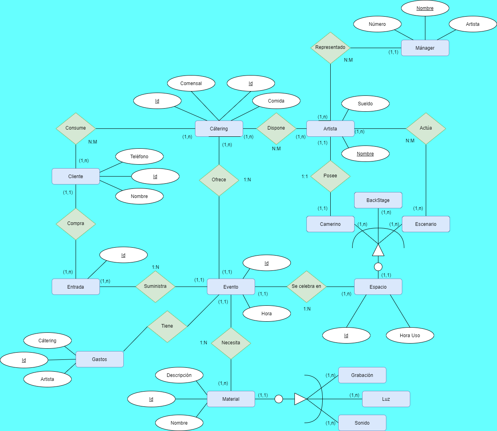

# 2. Modelo Conceptual
## 2.1. Especificaciones

Cada vez que el festival compra algún decorado, este será registrado en su correspondiente categoría,
ocurriendo lo mismo para cada una de las compras del evento.

Cuando un cliente compra una entrada, se emite una factura y se genera un apunte contable de tipo
entradas.

Se realizará un recuento de las entradas vendidas para obtener una idea general del aforo que tendrá
el evento.

Cada cliente queda registrado en una base de datos almacenando toda la información de este para
comprobar si está en la lista de integrantes que acudirán al festival.

Entre el cátering servido durante el evento diferenciamos el otorgado a los artistas, al personal y
por último al público.

Un material puede ser a la vez de varios tipos. Ejemplo: foco (luz y grabación).

El contacto con los artistas es efectuado a través de su mánager

## 2.2. Diagrama Entidad-Relación
