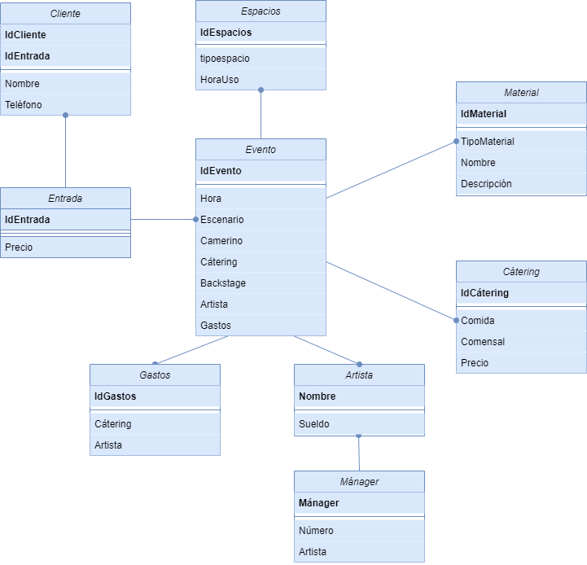

# 4. Modelo Físico
## 4.1. Diagrama de base de datos (notación "Crow's feet" o IDEF1X)



##  4.2. Creación de tablas y otros objetos

1º Creación de la base de datos:
```sql
CREATE DATABASE QuevedoFest;
```
2º Creación de las primeras tablas:
```sql
CREATE TABLE Espacios (
    IdEspacios NUMERIC(5),
    tipoespacio VARCHAR(30), 
    HoraUso VARCHAR(5),
    CONSTRAINT PK_IdEspacios PRIMARY KEY(IdEspacios)
);
```
```sql
CREATE TABLE Material (
    IdMaterial NUMERIC(5),
    TipoMaterial VARCHAR(30), 
    Nombre VARCHAR(30),
    Descripción VARCHAR(100),
    CONSTRAINT PK_IdMaterial PRIMARY KEY(IdMaterial)
);
```
```sql
CREATE TABLE Cátering (
    IdCátering NUMERIC(5),
    Comida VARCHAR(30), 
    Comensal VARCHAR(30),
    CONSTRAINT PK_IdCátering PRIMARY KEY(IdCátering)
);
```
```sql
CREATE TABLE Artista (
    Nombre VARCHAR(30), 
    Mánager VARCHAR(30),
    CONSTRAINT PK_Nombre PRIMARY KEY(Nombre)
);
```
```sql
CREATE TABLE Entrada (
    IdEntrada NUMERIC(5),
    CONSTRAINT PK_IdEntrada PRIMARY KEY(IdEntrada)
);
```
```sql
CREATE TABLE Cliente (
    IdCliente NUMERIC(5),
    IdEntrada NUMERIC(5),
    Nombre VARCHAR(30),
    Teléfono NUMERIC(9),
    CONSTRAINT PK_IdCliente PRIMARY KEY(IdCliente),
    CONSTRAINT IdEntrada_FK FOREIGN KEY (IdEntrada) REFERENCES Entrada(IdEntrada)
);
```
```sql
CREATE TABLE Evento (
    IdEvento NUMERIC(5),
    IdEntrada NUMERIC(5),
    IdMaterial NUMERIC(5),
    IdEspacios NUMERIC(5),
    IdCátering NUMERIC(5),
    Nombre VARCHAR(30),
    CONSTRAINT PK_IdEvento PRIMARY KEY(IdEvento),
    CONSTRAINT IdEntrada_FK FOREIGN KEY (IdEntrada) REFERENCES Entrada(IdEntrada),
    CONSTRAINT IdMaterial_FK FOREIGN KEY (IdMaterial) REFERENCES Material(IdMaterial),
    CONSTRAINT IdEspacios_FK FOREIGN KEY (IdEspacios) REFERENCES Espacios(IdEspacios),
    CONSTRAINT IdCátering_FK FOREIGN KEY (IdCátering) REFERENCES Cátering(IdCátering),
    CONSTRAINT Nombre_FK FOREIGN KEY (Nombre) REFERENCES Artista(Nombre)
);
```

## 4.3. Carga de datos de prueba

