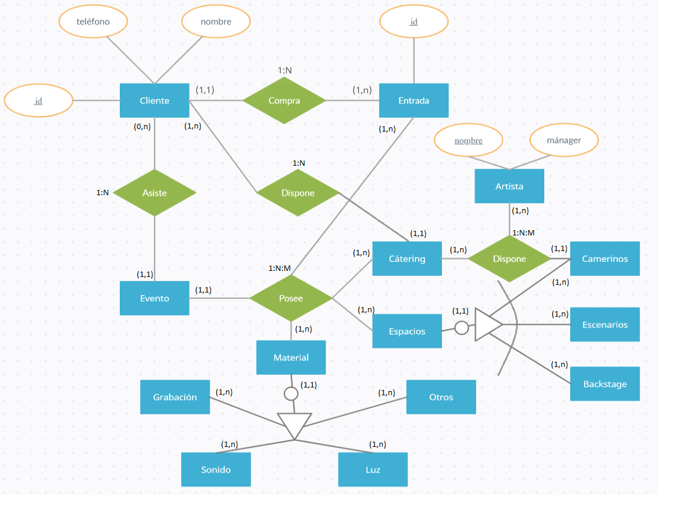

# QuevedoFest

- [ ] 1. Introducción
- [ ] 2. Modelo Conceptual
   - [ ] 2.1. Especificaciones
   - [ ] 2.2. Diagrama Entidad-Relación
- [ ] 3. Modelo Lógico 
   - [ ] 3.1. Modelo Relacional
   - [ ] 3.2. Normalización/Desnormalización
- [ ] 4. Modelo Físico
   - [ ] 4.1. Diagrama de base de datos (notación "Crow's feet" o IDEF1X)
   - [ ] 4.2. Creación de tablas y otros objetos
   - [ ] 4.3. Carga de datos de prueba
- [ ] 5. Consultas de la base de datos
   - [ ] 5.1. Consultas más frecuentes
   - [ ] 5.2. Consultas sencillas
   - [ ] 5.3. Consultas de agregación y resumen
   - [ ] 5.4. Consultas con subconsultas
- [ ] 6. Vistas, secuencias e índices
- [ ] 7. Scripts en PL/pgSQL
- [ ] 8. Extras
   - [ ] 8.1. Cursores
   - [ ] 8.2. Prototipo de interfaz de usuario
   - [ ] 8.3. Plan de pruebas
   - [ ] 8.4. Especificaciones de pruebas en [formato features Gherkin (ver ejemplo)](features/admin-carteles.feature) 
   - [ ] 8.5. Diagrama de clases
   - [ ] 8.6. Ejemplo de acceso a la base de datos con Java y JDBC
  
# 1. Introducción

En este proyecto se desarrollará el Área de Producción en relación al proyecto QuevedoFest.
En este área se tratarán todos los temas relacionados con el material físico empleado en el 
  desarrollo de este festival, así como los lugares y espacios necesarios para la correcta 
  organización de este.
  
Estos son los elementos sobre los que se trabajará, los cuales serán analizados uno a uno:
  
·MATERIAL: Aquí se tratarán cada uno de los componentes necesarios para el 
correcto funcionamiento del evento, como carteles informativos, folletos publicitarios, 
inmobiliario...
  
·LUZ: En este apartado se desarrollarán todos los elementos necesarios en lo referido a correcta 
  iluminación del evento, como pueden ser los distintos focos, lámparas o tubos fluorescentes.
  
·SONIDO: Análisis de cada uno de los objetos empleados que hacen referencia a la acústica del
  evento, entre los cuales podemos destacar altavoces, micrófonos, equipo de sonido...
  
·GRABACIÓN: Estudio del equipo necesario para el correcto montaje y grabación del acto. Este 
  equipo se compone principalmente por cámaras, personal, flashes externos y de estudio...
  
·ESPACIOS: Distinción de los diferentes espacios en los que se desarrollará el evento, diferenciando 
  así de forma independiente los camerinos, los escenarios y sus decorados, y el backstage.
  
·CÁTERING: Análisis del servicio de alimentación otorgado al público y al personal del evento.
  
# 2. Modelo conceptual
  ## 2.1. Especificaciones

Cada vez que el festival compra algún decorado, este será registrado en su correspondiente categoría, 
ocurriendo lo mismo para cada una de las compras del evento.

Cuando un cliente compra una entrada, se emite una factura y se genera un apunte contable de tipo 
entradas.

Se realizará un recuento de las entradas vendidas para obtener una idea general del aforo que tendrá
el evento.

Cada cliente queda registrado en una base de datos almacenando toda la información de este para 
comprobar si está en la lista de integrantes que acudirán al festival.

Entre el cátering servido durante el evento diferenciamos el otorgado a los artistas, al personal y 
por último al público.

Un material puede ser a la vez de varios tipos. Ejemplo: foco (luz y grabación).

El contacto con los artistas es efectuado a través de su mánager

  ## 2.2. Diagrama Entidad-Relación
